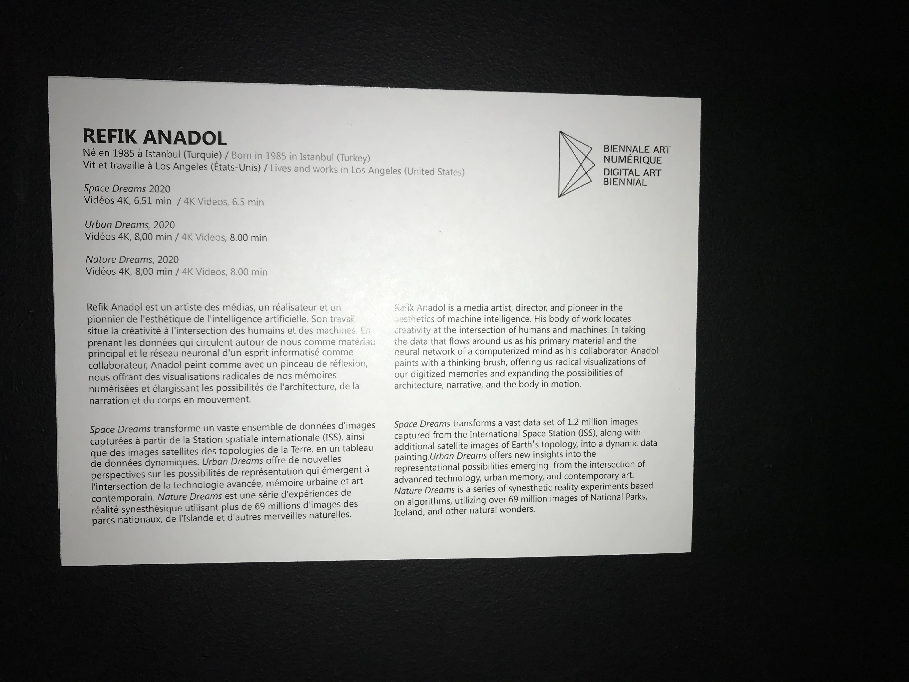

# TITRE DE L'OEUVRE :

## - Space Dreams
## - Urban Dreams
## - Nature Dreams

# ARTISTE :

## Refik Anadol

# ANNÉE DE RÉALISATION :

### 2020

# NOM DE L'ÉVÉNEMENT

## Metamorphosis - Biennal d'art numérique (BIAN)

# LIEU DE MISE EN EXPOSITION :

### 2020, rue William, Montréal
### Arsenal art contemporain

# DATE DE VOTRE VISITE :

### 09/02/2022

-------------------------------------------------------------------------------------------

# DESCRIPTION DE L'OEUVRE :

(photo du cartel de l'oeuvre lors de son exposition dans le BIAN)

# Explications sur la mise en espace de l'oeuvre ou du dispositif :
(texte à composer)

L'œuvre était exposé avec trois écrans 4k, il était à l'horizontale et rectangulaire. Placer les uns à côté de l'autre sur un mur avec une distance de 30, 40 centimètres entre eux. Il était quelques centimètres au-dessus du sol (30 à 40cm). Le niveau des yeux arrive pour la plupart des gens un peu au-dessus du milieu de l'œuvre. L'estimation de la largeur de l'œuvre est de 1 mètre et la hauteur de 1,40 mètre (ce ne sont que des estimation). Les écrans sont alimentés par des câbles cachés en bas de l'écran.

# Liste des composantes et techniques de l'oeuvre ou du dispositif :
(ex. : réalité virtuelle, projecteurs, caméra USB, anneau lumineux...)

- Écrans 4k
- Câbles

# Liste des éléments nécessaires pour la mise en exposition :
(ex. : crochets, sac de sable, câbles de soutien...)

- Soutien d'écran
- Mur
- Matériel pour cacher les câbles (plastique noir)

-------------------------------------------------------------------------------------------

#  Expérience vécue :

## Description de votre expérience de l'oeuvre ou du dispositif, de l'interactivité, des gestes à poser, etc. :

Mon expérience avec l’œuvre était moins interactive, mais plus admirative. L’œuvre est une vidéo de millions d’images se déplaçant ensemble sur un seul écran, j’ai donc trouvé intéressant de voir le mouvement presque organique que prenait les images qui formais des formes en cube et des couleurs vives. Il y avait aucun geste à poser la vidéo jouais à répétition il y avait 3 écrans un durait 6 :51 minutes et les autres 8 :00 minutes et il fessait des Loop donc il y avait aucune interactivité.

## ❤️ Ce qui vous a plu, vous a donné des idées et justifications :

J'ai aimer le mouvement dans l'oeuvres, resemblant quelque peu a des vagues, certain était calme et d'autre agiter.

## 🤔 Aspect que vous ne souhaiteriez pas retenir pour vos propres créations ou que vous feriez autrement et justifications :

-------------------------------------------------------------------------------------------

 
## Références :
 
- photographie de l'oeuvre ou du dispositif dans son ensemble
- photographies des composantes de l'oeuvre
- photographies des éléments nécessaires à sa mise en espace
- photographie du cartel ou du panneau explicatif
- autoportrait (photo) de vous avec l'oeuvre
- croquis de la mise en espace (choisir la vue la plus pertinente : plan ou élévation)
- possibilité d'intégrer de courts vidéos pour documenter les actions de l'oeuvre ou l'interactivité avec celle-ci
