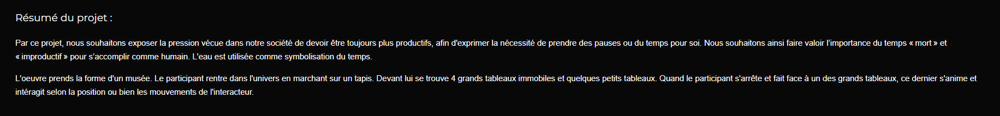

# TITRE DE L'EUVRE

Chronaufrage

# NOM DE L'ARTISTE OU DE LA FIRME

- Maloney Khim
- Sounthida Kong
- Olivier Lalonde
- Rebecca Pilotte
- Émilie Fontaine

# ANNÉE DE RÉALISATION

2022

# NOM DE L'ÉVÉNEMENT

Moebius (Projets synthèse des finissants en techniques d'intégration multimédia du collège Montmorency)

# LIEU DE MISE EN EXPOSITION

Studio C-1712, 475 Blvd de l'Avenir, Laval

# DATE DE VOTRE VISITE

24 mars 2022

# DESCRIPTION DE L'EUVRE

(source site web de l'évenement et de l'oeuvre (https://tim-montmorency.com/2022/projets/Chronaufrage/docs/web/index.html))

# Explications sur la mise en espace de l'oeuvre ou du dispositif (texte à composer)

# Liste des composantes et techniques de l'oeuvre ou du dispositif (ex. : réalité virtuelle, projecteurs, caméra USB, anneau lumineux...)

# Liste des éléments nécessaires pour la mise en exposition (ex. : crochets, sac de sable, câbles de soutien...)

# Expérience vécue :

## Description de votre expérience de l'oeuvre ou du dispositif, de l'interactivité, des gestes à poser, etc.

## ❤️ Ce qui vous a plu, vous a donné des idées et justifications

## 🤔 Aspect que vous ne souhaiteriez pas retenir pour vos propres créations ou que vous feriez autrement et justifications

# Références

- photographie de l'oeuvre ou du dispositif dans son ensemble
- photographies des composantes de l'oeuvre
- photographies des éléments nécessaires à sa mise en espace
- photographie du cartel ou du panneau explicatif
- autoportrait (photo) de vous avec l'oeuvre
- croquis de la mise en espace (choisir la vue la plus pertinente : plan ou élévation)
- possibilité d'intégrer de courts vidéos pour documenter les actions de l'oeuvre ou l'interactivité avec celle-ci
