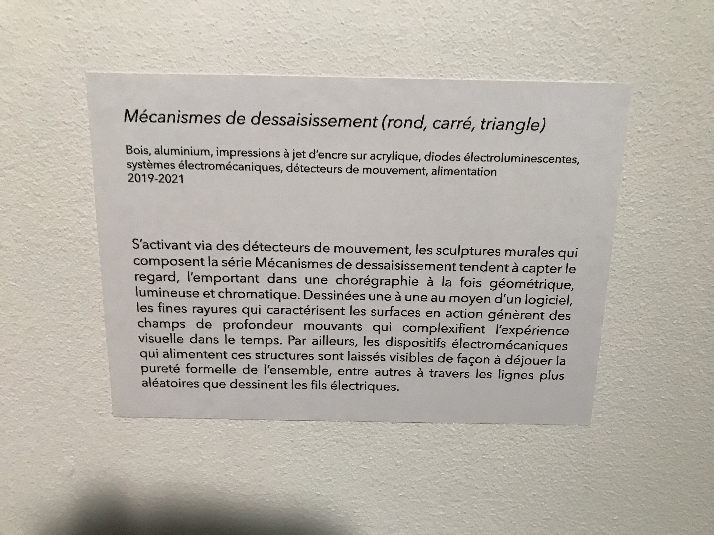

# TITRE DE L'EUVRE

Mécanismes de dessaisissement (rond, carré, triangle)

# NOM DE L'ARTISTE OU DE LA FIRME

Le duo Béchard Hudon

# ANNÉE DE RÉALISATION

2019 - 2021

# NOM DE L'ÉVÉNEMENT

Béchard Hudon - Configurations du sensible

# LIEU DE MISE EN EXPOSITION

La maison des arts de Laval (la salle Alfred-Pellan)

# DATE DE VOTRE VISITE

17 mars 2022

# DESCRIPTION DE L'EUVRE

(photo prise durent ma visite pour aller voir l'exposition)

# Explications sur la mise en espace de l'oeuvre ou du dispositif :
(texte à composer)

L'œuvre est disposée à 1 mètre au-dessus du sol et est accrochée aux murs. L'œuvre ressemble à un cadre blanc (carré, triangulaire ou circulaire) qui est avec un soutien en arrière du cadre qui distancie l'ouvre de 30 à 40 cm du mur montrant le mécanisme avec le quelle l'œuvre fonctionne. L'œuvre carrée est composée de deux carrés de vitre avec des liges de couleurs formant des formes sur eux il y a deux de ces carrés l'un est fait de lignes noires et l'autre de lignes bleues. Les carrés sont soutenus sur le cadre blanc sont soutenus part des sortes de bâtons noirs avec des lumières blanches en dessous des bâtons qui donne une meilleure opportunité d'apprécier l'ouvre étant mieux éclairer. Le mécanisme est différent pour toutes les formes, mais il est toujours visible en arrière du cadre blanc.

# Liste des composantes et techniques de l'oeuvre ou du dispositif :

- diodes électroluminescentes
- détecteur de mouvement
- système électromécanique (fait bouger l'oeuvre)
- Les deux carrés, les triangles et les ronds
- le soutien de l'oeuvre

# Liste des éléments nécessaires pour la mise en exposition :

- les câbles
- les detecteurs de mouvements
- un murs

source : https://bechardhudon.com/project/mecanismes-de-dessaisissement_divestment-mechanisms_2020/

Expérience vécue :

Description de votre expérience de l'oeuvre ou du dispositif, de l'interactivité, des gestes à poser, etc.

Mon expérience avec l’œuvre était admirative. La seule interaction possible était le fait que quand quelqu’un rentre dans la salle où ce situ les œuvres, les œuvres s’activent. L’œuvre montrant le mouvement de deux formes similaires, illuminer et avec des motifs.

❤️ Ce qui vous a plu, vous a donné des idées et justifications :

🤔 Aspect que vous ne souhaiteriez pas retenir pour vos propres créations ou que vous feriez autrement et justifications :

Références
- photographie de l'oeuvre ou du dispositif dans son ensemble
- photographies des composantes de l'oeuvre
- photographies des éléments nécessaires à sa mise en espace
- photographie du cartel ou du panneau explicatif
- autoportrait (photo) de vous avec l'oeuvre
- croquis de la mise en espace (choisir la vue la plus pertinente : plan ou élévation)
- possibilité d'intégrer de courts vidéos pour documenter les actions de l'oeuvre ou l'interactivité avec celle-ci
