# TITRE DE L'OEUVRE :

Contagion de la terreur

# NOM DES ARTISTES ET CONCEPTEURS :

- Laura Poitras (collaboration)
- Praxis Films (collaboration)
- Brian Eno (sonification de données)
- Edward Snowden (narrateur)
- Sarah Sun (son)
- Bethany Edgoose (vidéo)
- Exposition de Forensic Architecture

# ANNÉE DE RÉALISATION :

2021

# NOM DE L'ÉVÉNEMENT :

Contagion de la terreur

# LIEU DE MISE EN EXPOSITION

1, Place Ville Marie, Montréal

# DATE DE VOTRE VISITE

26 mars 2022

# DESCRIPTION DE L'EUVRE :

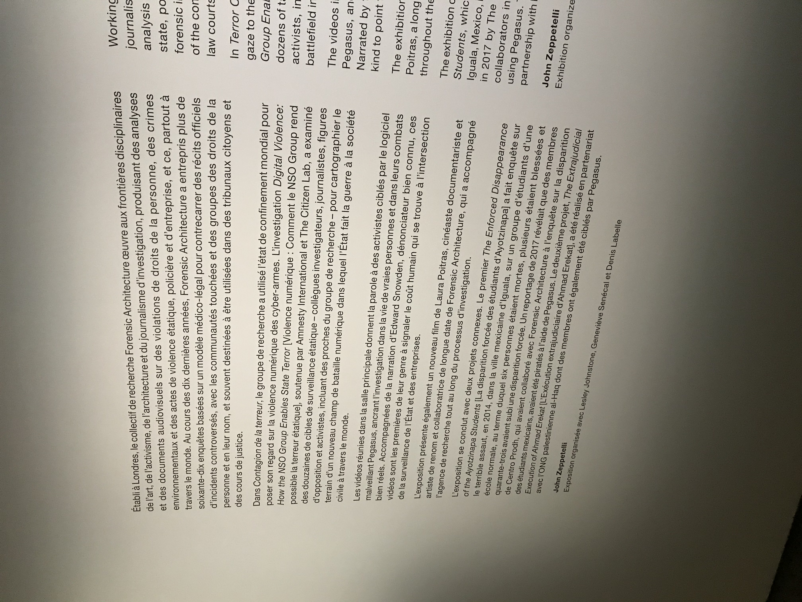
(photo prise durant visite de l'oeuvre : décrit contagion de la terreur)

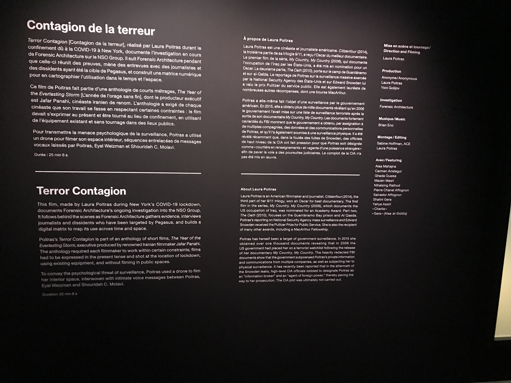
(photo prise durant visite de l'oeuvre : décrit oeuvre dans la salle 1) 

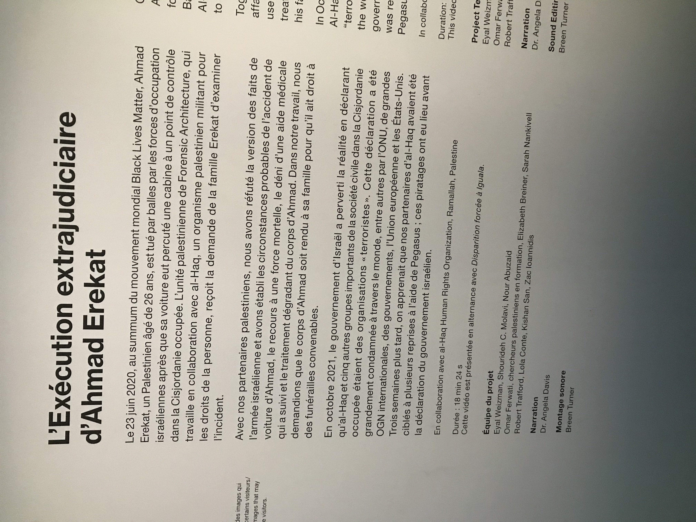
(photo prise durant visite de l'oeuvre : décrit la première vidéo jouer dans la salle 3)

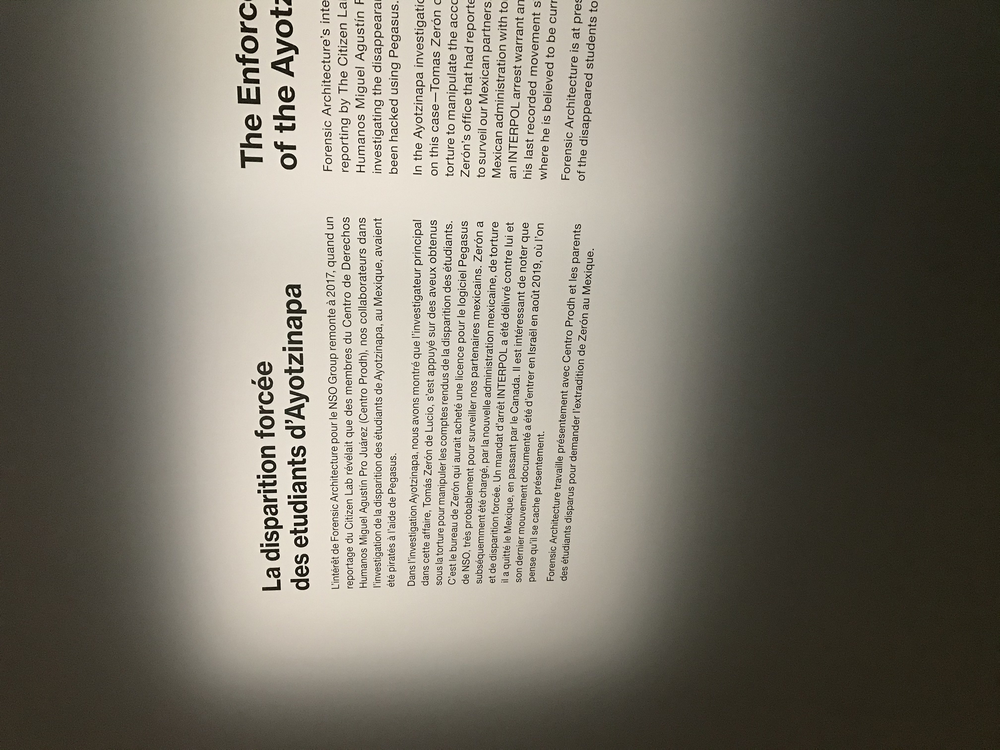
(photo prise durant visite de l'oeuvre : décrit la deuxième vidéo jouer dans la salle 3)

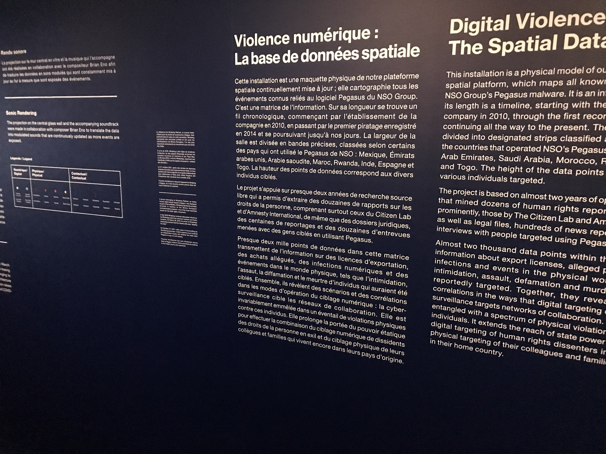
(photo prise durant visite de l'oeuvre : décrit l'oeuvre dans la salle 2)

# Explications sur la mise en espace de l'oeuvre ou du dispositif :

L’œuvre est nommé « Contagion de la terreur » séparer en trois salles, salle 1, il a un projecteur qui affiche une projection de l’autre côté de la salle montrant un cours film de sorte documentaire informatif sur les gouvernements qui espionne la population via la technologie. La salle contient aussi des sièges pour si assoir, des au parleurs au côté de la projection pour le son du cours documentaire et un éclairage du côté de la salle ou un projecteur illumine lu texte informatif sur le mur, c’est le seul endroit où il y a des lumières dans la salle 1. Les murs sont noirs.

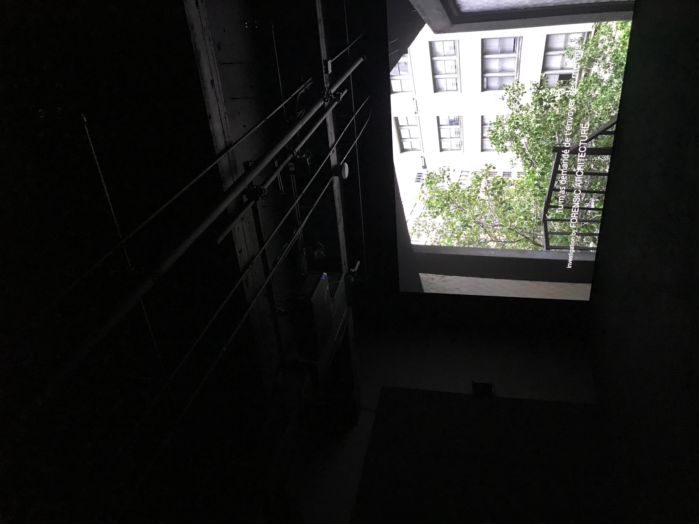
(photo prise durant la visite de l'oeuvre : photo de l'oeuvre de la salle 1 en ensemble)

La salle 2, est à la gauche de la salle 1 elle est accessible en sortant de la salle 1, l’entrer est à la gauche lorsque quelle qu’un sort de la salle 1 pour arriver à un cours couloir avec des information sur les murs illuminer par des lumières qui sont les seul dans la salle 2 qui est entièrement sans lumière avec un seul projecteur. À la fin dus cours couloir, vous arriver à la salle 2, qui est complétement ouverte mis a par le mur de vitre aux milieux de la salle avec un projecteur à sa gauche projetant un schéma mouvant montrant les actions d’espionnage informatique fait par certain gouvernement ou organisation. Il y a plusieurs écran soit soutenu par le plafond ou par les murs à travers la salle chacun avec des détecteurs proches sur le plafond détectant les interacteurs déclenchant le sont dans les appareils donner au début de l’expérience. Il y a en tout 8 écrans montrent différent témoignage des victimes ou de l’information. Les murs on le schéma des montrant les activités des gouvernements et organisations faisant de l’espionnage informatique.

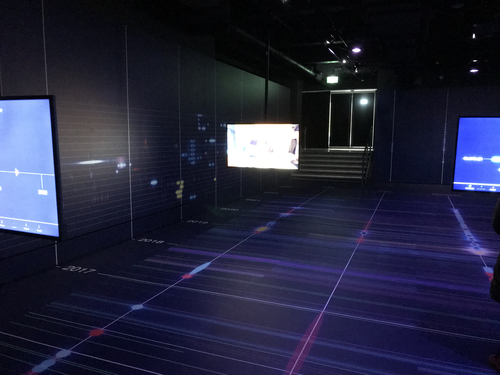
(photo prise durant la visite de l'oeuvre : photo de l'oeuvre de la salle 2 en ensemble)

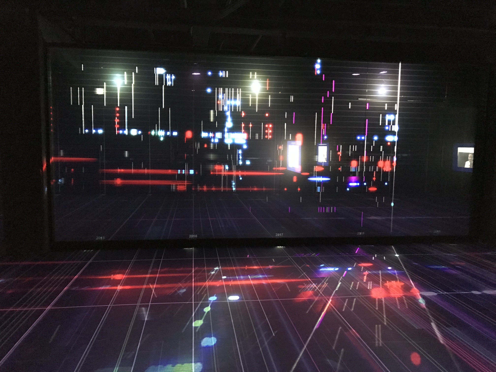
(photo prise durant la visite de l'oeuvre : photo de l'oeuvre de la salle 2 du mur de vitre)

La salle 3, est à la sortie de la salle 2 qui est son entré aussi. Des informations sont écrites sur les murs de droite et gauche de l’interacteur une fois que l’interacteur tourne à droite une fois sortie de la salle 2. Les murs sont blancs contrairement aux l’autres salles où ils sont noirs. Il y a des sièges devant la projection a devant l’interacteur une foi avoir tourner a droit après la sortie de la salle 2, devant lui il y a aussi la projection d’un projecteur un peu à l’arrière des sièges. Des au parleurs son situer non loin de la projection.

(photo prise durant la visite de l'oeuvre : photo exemple texte trouver autour de l'oeuvre de la salle 3)

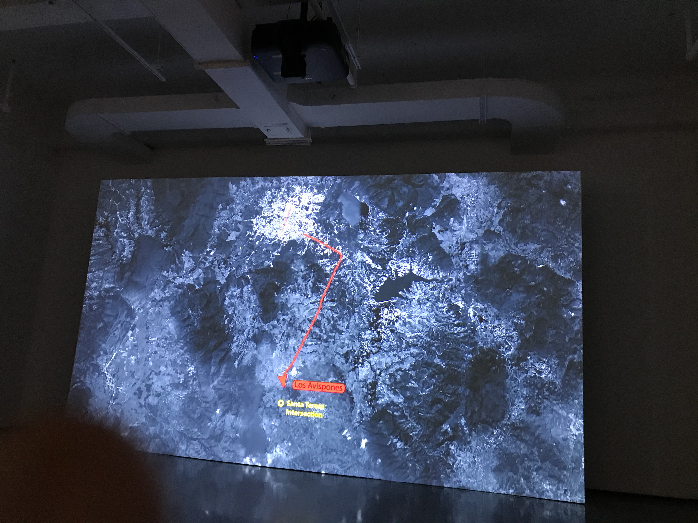
(photo prise durant la visite de l'oeuvre : photo de l'oeuvre dans la salle 3)

# Liste des composantes et techniques de l'oeuvre ou du dispositif : (ex. : réalité virtuelle, projecteurs, caméra USB, anneau lumineux...)

- 3 Projecteurs

(photo projecteur salle 3)

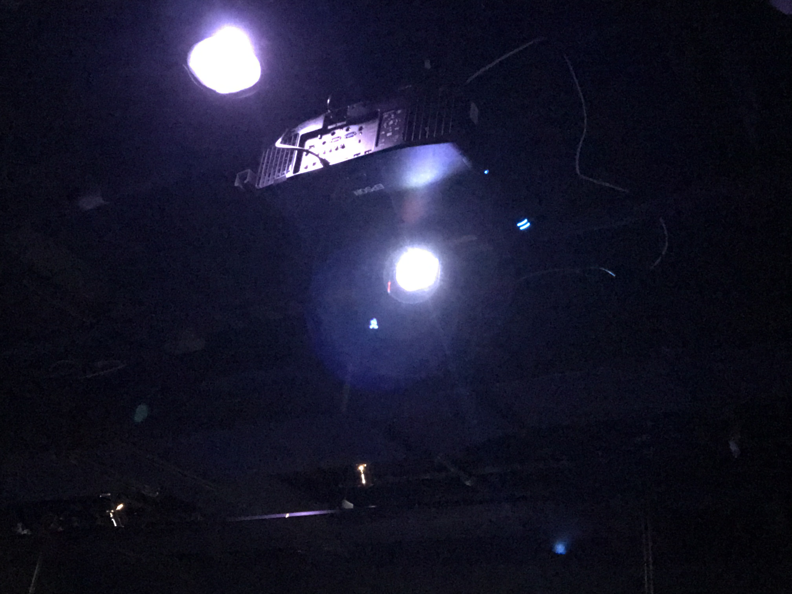
(photo projecteur salle 2)

(photo projecteur salle 1)

- Des projecteurs lumières

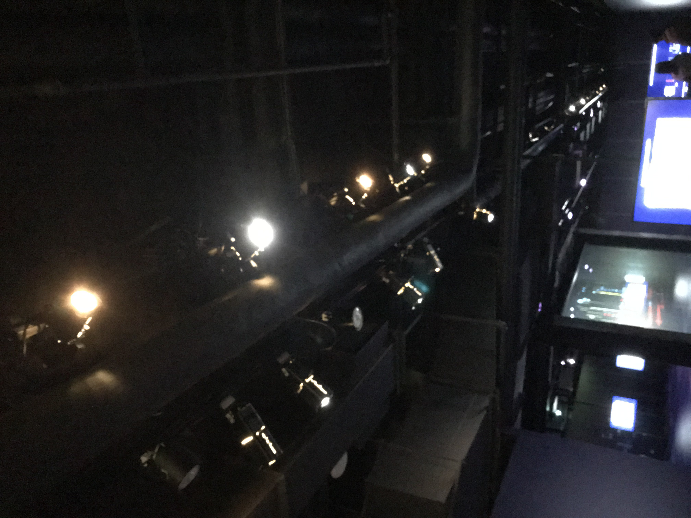
(photo éclerage salle 2)

- 8 écrans
- capteur de mouvment
- outil avec écouteurs

# Liste des éléments nécessaires pour la mise en exposition : (ex. : crochets, sac de sable, câbles de soutien...)

- mur de vitre
- 8 soutiens d'écrans
- des sièges

#  Expérience vécue :

 ## Description de votre expérience de l'oeuvre ou du dispositif, de l'interactivité, des gestes à poser, etc.
 
 La salle 1 demande seulement de s’assoir, d’écouter et regarder le cours documentaire projeter sur le mur. Le cours documentaire présente des informations introduisant l’idée de l’espionnage via l’informatique et ces impacte possible, ce qui peut être choquant.

La salle 2 présente plusieurs écrans placer dans un certain ordre non imposer, chacun des écrans montre un différant problème ou victime de l’espionnage de vie privée par l’informatique. Donc, un total de 8 histoires plus choquantes les unes que les autres. Chacun des écran présent un cours documentaire ou témoignage sur ce même thème durant de 3 minutes à 5 minutes. De plus, il y a le projecteur qui présente le schéma mouvant et changent des actions d’espionnages informatiques afficher sur les murs et sur le mur de vers au milieu de la salle pour pouvoir le regarder des deux côtés montrant son ampleur et son intimidation envers l’interacteur.

(mettre vidéo)

La salle 3, est très similaire à la première ayant seulement un projecteur montrant une projection, les différences étant que les murs sont blancs, il y a plus de texte sur les murs et le thème du documentaire présenter est diffèrent. Il y est présenté deux histoires une est l’histoire d’élèves ayant voulu s’exprimer et on finit par être arrêter par des moyens loin que légale et l’histoire d’un jeune homme abattu avec 6 balles en 2 seconde après un accident involontaire sur un post militaire dans un pays sous dictature. Des modèles 3D ont été recréé pour montrer les événements de façon plus précise que par image fixe. Pour mon cas c’est la troisième salle qui a eu le plus grand impacte.

 ## ❤️ Ce qui vous a plu, vous a donné des idées et justifications
 
 J’ai aimé dans l’œuvre la salle 2 ou ce trouve le mur de vers, j’ai aimé le mur de vers car il permettait de voir ce que projetait le projecteur tout en projetant sur le sol et les murs rendant l’expérience encore plus immersive.  Rendant l'œuvre inspirante, donnant une nouvelle manière de communiquer de l'information a l'interacteur.  L'utilisation de cette technique est donc plus intéressante si on désire communiquer de l'information différemment.

 ## 🤔 Aspect que vous ne souhaiteriez pas retenir pour vos propres créations ou que vous feriez autrement et justifications
 
 Ce que je changerais pour mes propres créations serai la durée des vidéos, car l’attention d’une personne est limitée et si les vidéos sont trop longes l’interacteurs va finir par partir étant non intéresser à l’œuvre. Je ferai les vidéos à un maximum de 3 minutes chaque pour donner le plus d’information en le moins de temps possible.

# Sources :

- Lien MAC : https://macm.org
- Lien contagion de la terreur : https://macm.org/expositions/contagion-de-la-terreur/
- Lien compagnie enquête contagion de la terreur : https://forensic-architecture.org
- Lien enquête contagion de la terreur plus précis : https://forensic-architecture.org/investigation/digital-violence-how-the-nso-group-enables-state-terror

 # Références
 
- photographie de l'oeuvre ou du dispositif dans son ensemble
- photographies des composantes de l'oeuvre
- photographies des éléments nécessaires à sa mise en espace
- photographie du cartel ou du panneau explicatif
- autoportrait (photo) de vous avec l'oeuvre
- croquis de la mise en espace (choisir la vue la plus pertinente : plan ou élévation)
- possibilité d'intégrer de courts vidéos pour documenter les actions de l'oeuvre ou l'interactivité avec celle-ci
